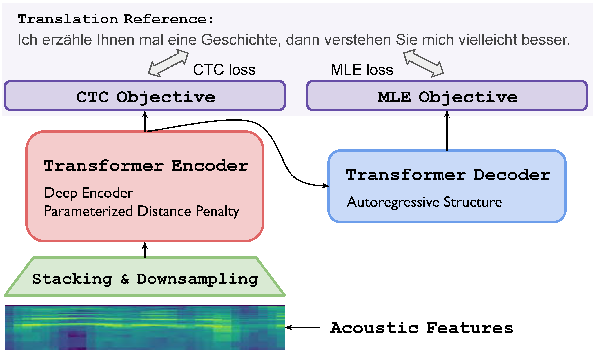

# Revisiting End-to-End Speech-to-Text Translation From Scratch


[**Paper**]() | 
[**Highlights**](#paper-highlights) |
[**Overview**](#model-visualization) |
[**Model**](#pretrained-models) |
[**Training&Eval**](#training-and-evaluation) |
[**Citation**](#citation)

This repository contains source code, models, and also instructions for our ICML paper. 

>Note, by ST from scratch, we refer to the setup where ST models are trained on speech-translation pairs
alone without using transcripts or any type of pretraining.

>By pretraining, we mainly refer to ASR/MT pretraining using the triplet training data.

## Paper Highlights

We explore the extent to which the quality of end-to-end speech-translation trained on speech-translation pairs alone and from
scratch can be improved.

- Techniques that are helpful for ST from scratch
    * deep encoder with post-layernorm structure (12 encoder + 6 decoder)
    * wide feed-forward layer (4096)
    * CTC regularization on top of the encoder with translation as labels
    * parameterized distance penalty (new proposal)
    * neural acoustic modeling (new proposal)
    * beam search hyperparameter tuning
    * smaller vocabulary size

- We find that:
    * The quality gap between ST w/ and w/o pretraining is overestimated in the literature
    * By adapting ST towards scratch training, we can match and even outperform previous studies adopting pretraining
    * Pretraining matters: 1) extremely low-resource setup; 2) when large-scale external resources are available

## Model Visualization



Apart from parameterized distance penalty, we propose to jointly apply MLE and CTC objective for training, **even though we use translation as CTC labels.**

## Pretrained Models


| Model     | BLEU on MuST-C En-De    |
|-----------|-------------------------|
|  Fairseq (pretrain-finetune)  | 22.7 |
|  NeurST (pretrain-finetune)   | 22.8 |
| Espnet (pretrain-finetune)    | 22.9 |
| this work (ST from scratch)   | [22.7](https://data.statmt.org/bzhang/icml2022_revisiting/) |


## Requirement

The source code is based on older tensorflow.

- python==3.6
- tensorflow==1.15+


## Training and Evaluation

Please check out the [example](./example) for reference.

* [preprocessing](./example/prepare.sh)
* [training](./example/train.sh)
* [decoding](./example/test.sh)

## Citation

If you draw any inspiration from our study, please consider to cite our paper:
```
@inproceedings{
zhang2022revisiting,
title={Revisiting End-to-End Speech-to-Text Translation From Scratch},
author={Biao Zhang and Barry Haddow and Rico Sennrich},
booktitle={International Conference on Machine Learning},
year={2022},
}
```
